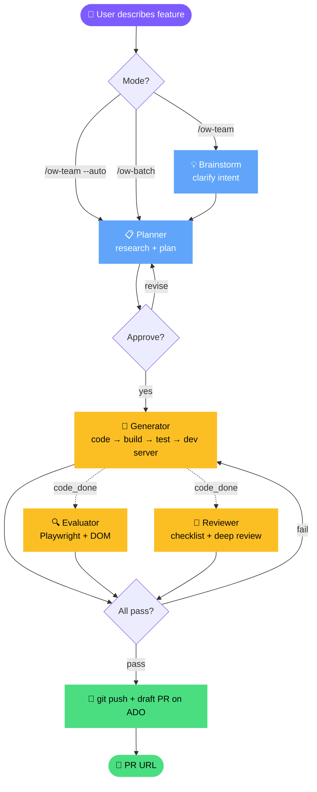

# dev.AgentOW

**A**gent for **O**dsp-**W**eb — multi-agent orchestration for odsp-web feature development.

A Claude Code plugin that runs a full pipeline of specialized agents to take you from a feature description to a draft PR, inside a GitHub Codespace.



> See [docs/architecture.md](docs/architecture.md) for the full invocation flow diagram with details.

---

## What it does

You describe a feature. The agent team:

1. Clarifies your intent through brainstorming
2. Researches the codebase and drafts an implementation plan
3. Asks for your approval
4. Implements the plan (code, build, test, start dev server)
5. Verifies acceptance criteria via Playwright MCP on a SharePoint page
6. Reviews the code (quick checklist + optional deep review)
7. If issues are found, fixes them (up to 5 cycles)
8. Pushes the branch and creates a draft PR on Azure DevOps

You can run it in two modes — see [Quick Start](#quick-start).

---

## Prerequisites

- Claude Code CLI
- GitHub Codespace with `odsp-web` cloned at `/workspaces/odsp-web`
- `tmux` installed in the Codespace
- Playwright MCP server (for evaluator browser verification)
- superpowers plugin (recommended, for brainstorming + deep review)

---

## Installation

### 1. Install the plugin

```bash
claude plugin marketplace add kaixun96/dev.AgentOW
claude plugin install agentOW@agentOW
```

Zero clone, zero build — the compiled MCP server is shipped with the plugin.

### 2. Install tmux (if missing)

```bash
sudo apt-get install -y tmux
```

### 3. Enable Agent Teams

Add to `~/.claude/settings.json`:

```json
{
  "env": {
    "CLAUDE_CODE_EXPERIMENTAL_AGENT_TEAMS": "1"
  }
}
```

### 4. Install superpowers (recommended)

Provides brainstorming and deep code review skills that agentOW integrates with.

```
/plugin marketplace add obra/superpowers-marketplace
/plugin install superpowers@superpowers-marketplace
```

### 5. Register Playwright MCP

```bash
claude mcp add --scope user playwright -- npx @playwright/mcp@latest --user-data-dir=/workspaces/.playwright-profile
```

On first run, the evaluator opens a browser. Log in to SharePoint manually once — the session persists.

### 6. Restart Claude Code and verify

```bash
claude plugin list        # agentOW should be enabled
claude mcp list           # ow server should be connected
claude agent              # agents should be listed
```

---

## Upgrading

```bash
claude plugin update agentOW@agentOW
```

Restart Claude Code afterwards. Or call `ow-version` in a session to check what version you're on.

---

## Quick Start

### Interactive mode (default)

```
/ow-team
> Implement a loading spinner for the photo grid component
```

The team will:
- Brainstorm with you to clarify intent (a few questions)
- Ask you to approve the implementation plan
- Confirm with you if review finds critical issues

Typical interaction count: 3–5 questions.

### Auto mode — zero interaction

```
/ow-team --auto
> Implement a loading spinner for the photo grid component
```

You provide one input. You get back one draft PR URL. Nothing in between.
- Brainstorm: skipped (planner makes reasonable assumptions)
- Plan approval: auto
- Review critical issues: auto-fix within the cycle limit; if still failing, PR is created as draft anyway

### Screenshot existing PRs — independent of the pipeline

```
/ow-screenshot 2219557                          # one PR
/ow-screenshot 2219557 2219558 2219559          # multiple PRs
```

For each PR, the agent traces the changed UI from source code, captures BEFORE (prod CDN) and AFTER (PR build) screenshots, and posts them as a PR comment. PRs where the surface can't be traced (server-side changes, external dependencies) are auto-skipped with a reason.

### Batch mode — drop a list, get a list of PRs

```
/ow-batch
1. Add loading spinner to PhotoGrid
2. Fix elevation background on mobile
3. Remove unused imports from sp-pages
... (10+ tasks)
```

Designed for "leave it overnight, come back to PRs". Each task gets a fresh agent team, runs in `--auto` mode, and produces its own PR. Failures in one task do not affect the rest. A summary file lists every result and PR URL.

> **Don't** invoke `claude agent ow-orchestrator` directly — always use `/ow-team` or `/ow-batch`. The orchestrator requires a properly set up Agent Team to function.

### Individual agents

```
claude agent ow-planner
> Research and plan how to fix the elevation background bug on mobile
```

### MCP tools directly

```
Use ow-status to check my environment
Use ow-build to build @ms/sp-pages
Use ow-start to launch the dev server for @ms/sp-pages
```

---

## Session Artifacts

Each `/ow-team` run creates `/workspaces/odsp-web/.aero/<session-name>/` with:

| File / Dir | Written by | Contents |
|---|---|---|
| `plans/plan.md` | planner | Spec, acceptance criteria, task list |
| `evaluation/YYYY-MM-DD-iter<N>.md` | evaluator | Per-criterion verification + screenshots |
| `evaluation/iter<N>/*.png` | evaluator | DOM screenshots |
| `review.md` | review-agent | Code review findings |
| `report.json` | all agents | NDJSON status records |
| `progress.log` | orchestrator | Real-time pipeline progress (visible via Monitor) |

---

## Architecture

Three-layer harness:

| Layer | Purpose | Components |
|-------|---------|------------|
| **Tools (MCP)** | Deterministic operations | rush, tmux, git, debug link, PR creation |
| **Agents** | Workflow separation | orchestrator, planner, generator, evaluator, reviewer |
| **Skills** | Knowledge injection | build rules, test conventions, PR workflow, Playwright |

### MCP Tools (16)

| Tool | Description |
|------|-------------|
| `ow-status` | Environment snapshot (git, node, rush, tmux) |
| `ow-rush` | Run any rush command |
| `ow-build` | rush build with structured error parsing |
| `ow-test` | rush test with Jest result parsing |
| `ow-start` | Launch `rush start` in tmux |
| `ow-debuglink` | Extract debug link → full SharePoint test URL |
| `ow-git` | Run git commands with structured output |
| `ow-session-{open,send,capture,list,kill,interrupt}` | tmux pane control |
| `ow-pr-create` | Push branch + create draft PR on Azure DevOps |
| `ow-pr-attach` | Upload screenshots to a PR; append to description or post a comment |
| `ow-version` | Check plugin version and update availability |

### Agents

| Agent | Role |
|-------|------|
| `ow-orchestrator` | Drive the pipeline (no source code access — pure dispatcher) |
| `ow-planner` | Research codebase, draft plan |
| `ow-generator` | Implement, build, test, start dev server |
| `ow-evaluator` | Verify via Playwright MCP + code inspection |
| `ow-review-agent` | Pre-PR code review |

All agents run on Claude Opus 4.7 in a persistent Agent Team — generator at cycle 2 retains full context from cycle 1.

### Skills

| Skill | Trigger keywords |
|-------|------------------|
| `ow-team` | Run the full pipeline (entry point) |
| `ow-batch` | Run multiple tasks overnight, one PR per task |
| `ow-screenshot` | Capture BEFORE/AFTER screenshots for existing PR(s) and post as PR comment |
| `ow-dev-build` | rush build/install/update |
| `ow-dev-test` | rush test, Jest |
| `ow-dev-git` | git, branch, checkout |
| `ow-dev-debuglink` | rush start, debug link |
| `ow-dev-playwright` | Playwright MCP, browser verification |
| `ow-dev-pr` | PR, az repos |
| `ow-ref-monorepo` | monorepo structure, Rush/Heft |
| `ow-ref-external-tools` | killswitch, GUID, Bluebird, ADO work items |
| `search-odspweb-wiki` | wiki, documentation |

---

## Contributing

External contributions go through pull requests:

1. Fork or branch from `main`
2. Push your changes to a feature branch
3. Open a PR against `kaixun96/dev.AgentOW:main`

---

## Repository

- GitHub: https://github.com/kaixun96/dev.AgentOW
