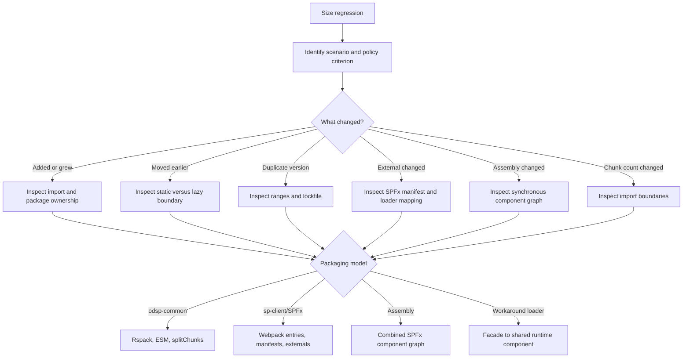

# Size regression diagnosis and review

Use this reference when a local or PR size audit reports a regression, or when a change modifies
runtime imports, dependencies, lazy boundaries, SPFx manifests/assemblies, Webpack/Rspack
configuration, shared bundles, or workaround-loader mappings in a way that can change packaging.

Do not optimize the file named in the report until you identify:

1. the regressed scenario and policy criterion;
2. the FMP, FCI, or All timing bucket;
3. the package/module that owns the added bytes;
4. the packaging model that placed those bytes there; and
5. whether code was added, grew, moved earlier, or was duplicated.



## Rules that prevent false fixes

1. Moving code to an SPFx external does not make it free. The auditor attributes external
   library chunks to consumers at their actual load timing.
2. A smaller entry chunk is not necessarily a smaller experience. Compare FMP, FCI, All, raw,
   gzip, and request/chunk count.
3. A package declaration is not a bundling instruction. `peerDependencies`, matching chunk
   names, and SPPKG settings do not automatically externalize or share code.

## Read the official result first

The official local/PR policy report is the source of truth. Record:

| Field | Meaning |
|---|---|
| Scenario | `<compilation-name>/<scenario-name>` |
| Criteria | Added chunks, raw/parse bytes, or gzip/network bytes at FMP, FCI, or All |
| Allowed | Effective configured threshold, including authorized approvals |
| Actual | Current minus baseline delta, not absolute size |
| Margin | `Actual - Allowed` |
| Approvers | Registered owners for the scenario |

Timing buckets are cumulative: FMP is startup, FCI includes FMP plus early interaction chunks,
and All includes on-demand chunks. Moving bytes earlier can regress FMP/FCI while All remains
flat. Read the owning project's `config/size-auditor.json`; omitted fields have no policy and
policies may target selected `scenarioNames`.

Check baseline warnings before changing code. If the desired successful main baseline was
unavailable, confirm an intervening main change is not being charged to the PR. Analyzer output
is diagnostic evidence, not a replacement for the official policy result.

## Packaging models

### Compiled libraries

ODSP libraries commonly emit CommonJS (`lib-commonjs`), ESM (`lib-esm`), and declarations
(`lib-dts`). A package is normally a module tree, not a pre-bundled copy of its dependencies.
Application bytes enter only when consumers import the graph. Root barrels, side effects,
CommonJS boundaries, and changed dependency ranges can defeat pruning or add versions.

### `odsp-common` applications

Rspack consumes explicit ESM entrypoints, commonly uses `splitChunks: { chunks: "all" }`, honors
side-effect metadata, and performs used-export analysis. Runtime dependencies are bundled unless
configuration explicitly externalizes them. Shared chunks deduplicate only inside one
compilation; matching chunk names cannot share code across applications/configurations.

Tree-shaking requires analyzable ESM, accurate `sideEffects`, no dynamic namespace lookup, and
no required top-level initialization hidden behind a bypassed barrel. Never change `sideEffects`
without auditing registrations, styles, polyfills, and initialization.

### `sp-client` and SPFx

`config/config.json` defines Webpack bundle ownership. A bundle may own one or several
components. Manifest-backed dependencies and explicit/built-in externals can stay outside the
consumer entry while still counting toward the experience.

Inspect these exceptions before changing imports:

- `linkedExternalsToBundle` forces selected externals back into the local bundle;
- version-gated wrappers bundle incompatible versions locally;
- static runtime imports create eager AMD dependencies;
- only genuinely asynchronous `import()` usage lets `AsyncComponentPlugin` remove an external
  from eager entry chunks; `asyncComponents` enforces that boundary but does not create it.

The auditor attributes SPFx library chunks to every consuming scenario at the timing they are
required. Expanding a shared library can regress many consumers even when their entry chunks do
not grow.

### SPFx assemblies

`bundle-assembly.json` combines an assembly root, its manifest dependency graph, and startup
loader code after Webpack. A new synchronous component dependency can pull a complete component
into every assembly containing it. Inspect the component graph before optimizing source modules;
SPPKG/package-solution changes happen too late to alter assembly content.

### Workaround loaders

Current SPFx workaround loaders redirect supported imports to curated runtime components. A
mapping applies only when the destination external exists and package name, version, resolution
metadata, and normalized subpath match. A miss can bundle the original implementation while the
shared external remains, causing duplicate bytes and potentially duplicate React, styling, or
singleton state.

Adding a mapping is not automatically a win: the shared component is still attributed to
consumers, application tree-shaking cannot prune an already-built external, and a new request can
worsen cold load. Validate destination exports, runtime identity, all consumers, and assemblies.

## Diagnostic workflow

1. Read the official regression and record scenario, criterion, allowed, actual, margin, and any
   baseline warning. Do not increase the allowance first.
2. Classify the shape:

   | Signal | Initial hypothesis |
   |---|---|
   | FMP/FCI grew; All flat | Code moved earlier |
   | All grew | New or larger implementation |
   | Chunk count grew | New import boundary |
   | Two package versions | Dependency duplication |
   | Fluent/React/ODSP package appears locally in SPFx | Loader/externalization miss |
   | Many scenarios regress | Shared SPFx library/common dependency grew |
   | Assembly grows as one component | Synchronous component graph changed |
   | Root barrel owns many additions | Barrel/side-effect expansion |

3. Reproduce in an ODSP Codespace:

   ```bash
   rush build --to @msinternal/size-auditor
   node tools/size-auditor/release/tools/size-auditor/baseline-cli.js get
   rush size-audit --to <project-name>
   node tools/size-auditor/release/tools/size-auditor/diff-cli.js --local
   node tools/size-auditor/release/tools/size-auditor/policy-cli.js --local
   ```

4. If and only if the policy result reports a regression, run diagnosis:

   ```bash
   node tools/size-auditor/release/tools/size-auditor/analyze-cli.js \
     --baseline tools/size-auditor/baseline/webpack-stats_DEV \
     --current tools/size-auditor/current \
     --scenario <scenario-name>
   ```

   `analyze-cli` exits nonzero when it finds regressions; that is not an infrastructure failure.
   Missing stats for a selected project can be a successful no-op.

5. For each top contributor determine source/package ownership, version, introducing import,
   timing, duplicates, barrel/dynamic lookup, manifest externalization, loader match,
   `linkedExternalsToBundle`, and version-gated fallback.
6. Apply the narrowest fix, rerun targeted tests and the production size audit, and validate cold
   and warm runtime behavior when an external/shared component changed.

## Remediation matrix

| Regression | Preferred investigation and fix |
|---|---|
| FMP/FCI up, All flat | Find static import/eager barrel; restore a real lazy boundary at use |
| All raw/gzip up | Rank modules; remove, narrow, replace, or split the dependency |
| Chunk count up | Remove duplicate boundaries or consolidate tightly coupled cold modules |
| Duplicate versions | Run `rush why`; align compatible ranges and update lockfile |
| Local Fluent/React in SPFx | Verify external, package, version, subpath, and destination export |
| Shared component growth | Prove net benefit across all consumers/assemblies or revert growth |
| Assembly growth | Remove optional dependencies from the synchronous component graph |
| Barrel expansion | Verify ESM and side effects; use a supported direct export when safe |
| App chunk shrinks but cold load worsens | Reconsider externalization timing/request cost |

Use `import type` for type-only dependencies. Do not bypass a supported barrel if it performs
required initialization, and never deep-import a private path. Use PNPM overrides only after
proving compatibility, especially for React, Fluent, MSAL, and singleton-bearing packages.

## Forbidden fixes

- Increasing the threshold or requesting approval before understanding ownership and impact.
- Moving bytes to a shared bundle merely to change report ownership.
- Returning an empty loader facade, suppressing a warning, or declaring an external without a
  deployed component/manifest/export.
- Setting `sideEffects:false` globally without an initialization audit.
- Adding blind aliases or forcibly deduplicating incompatible singleton packages.
- Optimizing only local entry size while ignoring FMP, FCI, All, gzip, and requests.

An intentional regression may be accepted only when user value, alternatives, startup/total
impact, shared blast radius, runtime performance, owning approver, and removal plan are recorded.
Approval records accepted cost; it is not a technical fix.

## Review checklist

- Read the PR's official size-audit report, not only local entry stats or analyzer output.
- Verify desired versus available baseline and the owning `config/size-auditor.json` policy.
- Identify packaging model, scenario owner, timing, manifest/external/assembly ownership, and
  loader matching where applicable.
- Compare FMP, FCI, All, raw, gzip, and chunk count.
- Verify duplicate versions with `rush why`, ESM/CommonJS resolution, barrels, and side effects.
- Require targeted tests, a passing production size audit or explicit approved exception, and
  runtime validation for changed external/shared loading.
- Every finding must name the likely owning import/package/configuration boundary and a concrete
  fix direction. Do not report only that bundle size increased.

## Key sources

- `tools/size-auditor/README.md`
- `tools/webpack-auditor-stats-plugin/src/AuditorStatsPlugin.ts`
- `tools/size-auditor/src/logic/computeDiffInfo.ts`
- `tools/size-auditor/src/cli/analyze-cli.ts`
- `tools/webpack-auditor-stats-plugin/src/schemas/size-auditor.schema.json`
- `sp-client/spfx-tools/spfx-heft-plugins/src/plugins/webpackConfigurationPlugin/WebpackConfigurationGenerator.ts`
- `sp-client/spfx-tools/spfx-heft-plugins/src/plugins/webpackConfigurationPlugin/webpackPlugins/AsyncComponentPlugin.ts`
- `sp-client/tools/spfx-internal-heft-plugins/src/plugins/bundleAssemblyPlugin/AssemblyBundler.ts`
- `sp-client/tools/spfx-internal-heft-plugins/src/plugins/updateWebpackConfigPlugin/loaders/`
- `odsp-common/tools/odsp-common-webpack-config-generator/src/createConfig.ts`